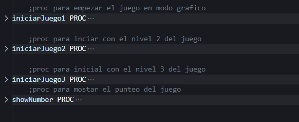
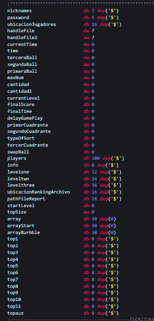
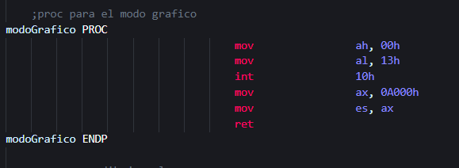
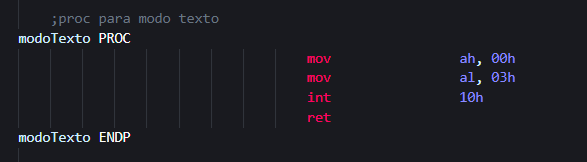
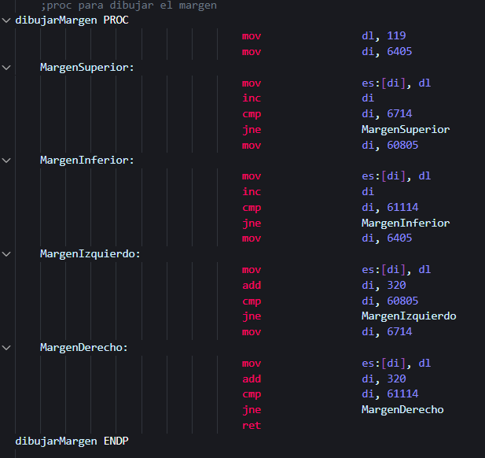

# Manual Tecnico
- [Manual Tecnico](#manual-tecnico)
  - [Macros para Manejo de Archivos](#macros-para-manejo-de-archivos)
  - [Macros para Bloques, Pelota y Barra del Juego](#macros-para-bloques-pelota-y-barra-del-juego)
  - [Macros Utilidad Para el Proyecto](#macros-utilidad-para-el-proyecto)
  - [Logica Juego](#logica-juego)
  - [Modo de Video, Margen, Modo Texto](#modo-de-video-margen-modo-texto)
## Macros para Manejo de Archivos

* GetPathFile: esta macro basicamente lo que hace es que el usuario escriba el nombre del archivo a abrir
* OpenFile: esta macro lo que realiza es abrir el archivo solicitado
* CreateFile: esta macro crea un archivo con un contenido especificado
* writeFile: esta macro escribe el contenido para el archivo a crear
* closeFile: cierra el archivo ya una vez terminado la creacion, lectura o escritura
* deteFile: esta macro elimina un archivo especificado

## Macros para Bloques, Pelota y Barra del Juego
* pintaBolita: esta macro lo que realiza es pintar la bolita para el juego en una posicion especificado, por eso recibe dos parametros, donde pos es transferido al registro DI y color al de DL
* dibujarBloques: esta macro lo que realiza es pintar los bloques en el juego recibiendo una posicion y color como parametros, donde pos es transferido al registro DI y color al de DL 
* dibujarBarraJuego: esta macro lo que realiza es pintar la barrita que se ira moviendo durante el juego donde recibe como parametros pos y color, donde pos es transferido al registro DI, y color al de DL 
   

## Macros Utilidad Para el Proyecto
* printArray: lo que realiza es imprimir en pantalla la informacion que se le pase como parametro
* print: imprime igual que el anterior solo que sin el salto de linea
* printChar: imprime un caracter en pantalla
* getLinea: Lee en consola lo que el usario escriba
* getChar: obtiene un caracter por consola
* clean: esta macro es utilizada para el manejo de archivos donde limpia el buffer
* delay: esta macro es utilizada para dar un cierto delay al juego 

## Logica Juego

En la siguiente imagen se observaran 3 procedimientos aqui es donde va la logica del juego, donde practicamente lo que hacia era llamar las macros pintaBolita, dibujarBloques y dibujarBarraDeJuego, donde a los bloques la logica era algo simple ya que los pinto, pero una vez la bolita los toca, lo que hacia era que los pintaba de otro color para simular su destruccion. al igual la pelotitas para que salgan varias utilice 3 variables de pelota donde en cada nivel fueron utilizada, para la velocidad se hizo la utilizacion del macro delay, entre menor es el delay mas rapido es la bolita, solo en la pelotita 3 para el nivel 1 se buggea con el delay xD 

## Modo de Video, Margen, Modo Texto

* Modo Video: el modo de video utilizado fue el 10h haciendo practicamente salir de la pantalla de comando la tipica de int 21h, donde esta fue la que permitio la realizacion del juego

* Modo Texto: este metodo lo que hacia era una vez se perdia en el juego, o al poner pausa y salirse, regresaba al modo normal de cuando se inicia el dosBox
  
  

* Margen: este procedimiento ayudo a realiza el dibujo del margen donde el registro DL fue de utilidad ya que el recibia un color deseado para pintar dicho margen xd 

