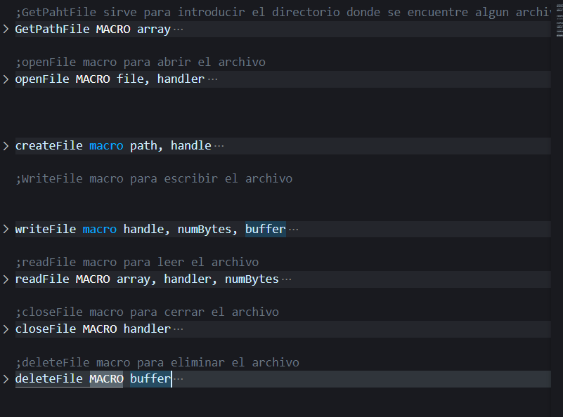
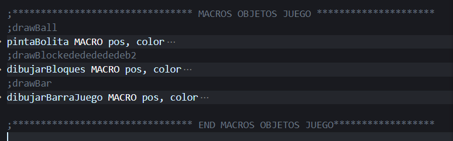
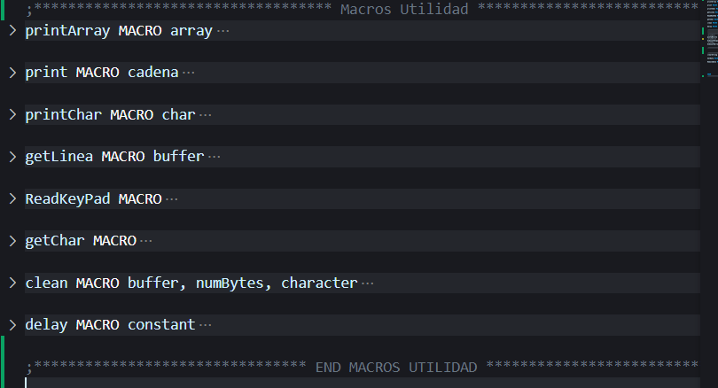

# Manual Tecnico

## Macros para Manejo de Archivos

* GetPathFile: esta macro basicamente lo que hace es que el usuario escriba el nombre del archivo a abrir
* OpenFile: esta macro lo que realiza es abrir el archivo solicitado
* CreateFile: esta macro crea un archivo con un contenido especificado
* writeFile: esta macro escribe el contenido para el archivo a crear
* closeFile: cierra el archivo ya una vez terminado la creacion, lectura o escritura
* deteFile: esta macro elimina un archivo especificado

## Macros para Bloques, Pelota y Barra del Juego
* pintaBolita: esta macro lo que realiza es pintar la bolita para el juego en una posicion especificado, por eso recibe dos parametros, donde pos es transferido al registro DI y color al de DL
* dibujarBloques: esta macro lo que realiza es pintar los bloques en el juego recibiendo una posicion y color como parametros, donde pos es transferido al registro DI y color al de DL 
* dibujarBarraJuego: esta macro lo que realiza es pintar la barrita que se ira moviendo durante el juego donde recibe como parametros pos y color, donde pos es transferido al registro DI, y color al de DL 
   

## Macros Utilidad Para el Proyecto
* printArray: lo que realiza es imprimir en pantalla la informacion que se le pase como parametro
* print: imprime igual que el anterior solo que sin el salto de linea
* printChar: imprime un caracter en pantalla
* getLinea: Lee en consola lo que el usario escriba
* getChar: obtiene un caracter por consola
* clean: esta macro es utilizada para el manejo de archivos donde limpia el buffer
* delay: esta macro es utilizada para dar un cierto delay al juego 

