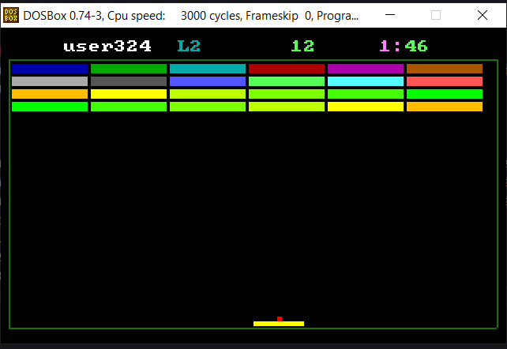

# Manual De Usuario

- [Manual De Usuario](#manual-de-usuario)
  - [Inicio Menu](#inicio-menu)
  - [Juego](#juego)
  - [Nivel 2](#nivel-2)
  - [Nivel 3](#nivel-3)
  - [Reportes](#reportes)
## Inicio Menu
Interfaz de Inicio donde al iniciar la aplicacion el usuario se le desplegara el siguiente menu

El cual al ingresar la opcion 2 podra registrar nuevos usuarios 

Si ingresamos la opcion 1 nos pedira los datos del usuario, que seran verificados con un archivo txt nombrado players.txt

## Juego
Una vez ingresados los datos del usuario en el login se podra iniciar el juego, tambien siendo correctos dichos datos.

En la imagen se muestra que empieza en el nivel 1, con la tecla ESC se coloca pausa, para volver al menu principal se preciona la barra espaciadora, si quedemos quitar la pausa volvemos a presionar ESC, o si queremos pasarnos a otro nivel presionamos
 1 - nivel 1 
 2 - nivel 2 
 3 - nivel 3 

 ## Nivel 2 
Una vez ganado el nivel anterior, pasamos al nivel 2 donde al destruir 12 bloques se va a aumentar la dificultad aumentando la velocidad del movimiento de la pelota y saldra una segunda pelota 

## Nivel 3
Una ganado el segundo nivel pasamos al tercero y ultimo, donde al destruir 12 bloques sale una segunda pelota, al destruir 24 bloques sale la tercera pelota con una velocidad mayor a la que la segunda pelota, siendo imposible ganar xD

## Reportes
Pendiente 